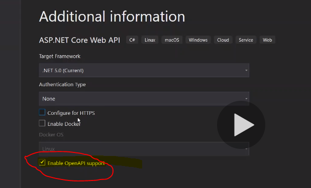

#### Docker Commands
###### Frequently used docker commands
>
```powershell
docker -version #to Get installed docker version
docker pull <image name>
```

##### To Add splittor line
---
##### To Add References
>Document ref
>Refer- [Frequently used Docker commands](../Docker/Containers/Docker-Frequently-Used-Comments.md)

- Display Image from local


- Display Image Reference


- Image link
[](http://google.com.au/)


[//]: # (Tags: Frequently Used Docker Commands, Docker with interactive Mode, Docker)
[//]: # (Type: Docker - Commands)
[//]: # (Rating: 2)
[//]: # (Languages:powershell|ini)
[//]: # (ReadyState:Inprogress|Publish)
