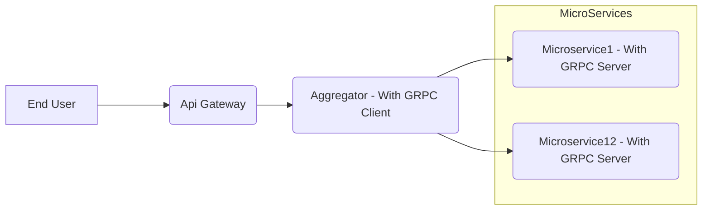
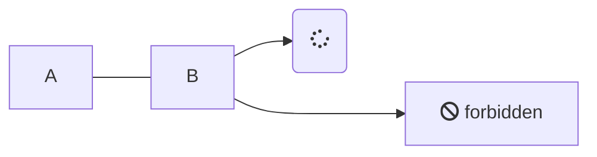

#### Docker Commands
###### Frequently used docker commands
>
```powershell
docker -version #to Get installed docker version
docker pull <image name>
```
<u>For Under Line Text</u>
<s>For Under Line Text</s>

### Special Letter Format
$Sarav$
*Sarav*
~Sarav~
Sarav


##### To Add splittor line
---
##### To Add References
>Document ref
>Refer- [Frequently used Docker commands](../Docker/Containers/Docker-Frequently-Used-Comments.md)

## Display Image from local

### Public Images

### Private Images


- Display Image Reference


- Image link
[](http://google.com.au/)

###### Mermaid
* Flowchart

* Graph



[//]: # (Tags: Frequently Used Docker Commands, Docker with interactive Mode, Docker)
[//]: # (Type: Docker - Commands) --Here - is important otherwise my code gives error :-)
[//]: # (Rating: 2)
[//]: # (Languages:powershell,powershell,ini)
[//]: # (ReadyState:Inprogress|Publish)
