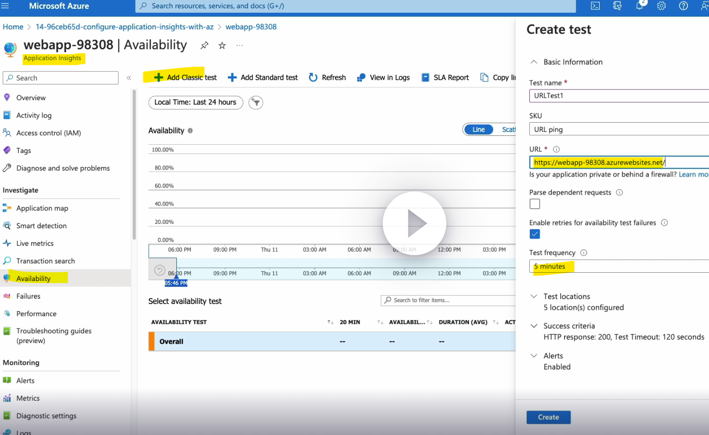

#### Azure App Insights
- It is an application performance monitoring (APM) service that provides a comprehensive view of your application's performance and health.
- App Insights collects telemetry data from your application, such as performance metrics, logs, and traces.
- It then analyzes this data to provide you with insights into how your application is performing, and to help you identify and troubleshoot any problems.

In .net core we can use below nuget package to send the app insights data to App Inghts
```
Microsoft.ApplicationInsights.AspNetCore
```

#### Pricing
It's free to sign up, and if you choose the basic pricing plan of Application Insights, there's no charge until your application has grown to have substantial usage.

---
### Difference between Azure Monitor and App insights
##### Azure Monitor
- Azure Monitor Can be used to monitor a wide variety of Azure resources, including virtual machines, Azure App Service, Azure Functions, and Azure SQL Database.
- It can also be used to monitor on-premises resources and custom sources.
- Azure Monitor collects telemetry data from these sources and provides a variety of tools for analyzing and reporting on the data.

##### Azure App Insights
- This is like Elastic APM
- It Specifically designed to monitor the performance and health of web applications.
- It collects telemetry data from your application, such as performance metrics, logs, and traces.
- It then analyzes this data to provide you with insights into how your application is performing, and to help you identify and troubleshoot any problems.

---

#### Configure App Insights while creating webapp


---
#### Configure App Insights

---


#### How to use App Insights in code
- Create App insights in Az portal
- Get Instrumentation key (refere belwo image)
- Use Microsoft.ApplicationInsights.AspNetCore nuget package to push the data


### We can setup monitor in App INsights
1. Url ping test
2. Multi step web test
3. Custom TraCK AVALIABILITY TEST


#### How to configure URL ping test
1. Enable App insights for an webapp
2. Go to resources list and select newly created App insights



> ***We can take action on some scenearios For that - Go to action section, create Action Group***


### Application Mapp
Azure Application Map is a feature of Azure Application Insights that provides a visual overview of your application’s architecture and the interactions between its components1
