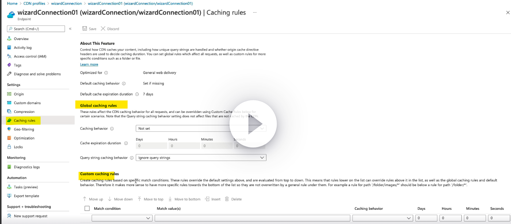

1. CDN - Cache Images,Videos, documents etc,
2. Cache for REDIS - we can use it for data caching for applicaton level
3. Front Door -

#### CDN Caching
  1. Query string Caching
  2. based on Rules
    - Global caching rules : One rule per end point which affect all requests
    - Custom Caching rules : based on specific paths. It can override global caching rules

### Modes in Query string Caching
##### Ignore query strings
  This is the default mode. In this mode, Azure CDN ignores the query strings in requests and serves the same cached response to all requests for the same URL. (Ex: CSS,JS)

##### Bypass caching for query strings
  In this mode, Azure CDN never caches requests with query strings (Dynamic pages)

##### Cache every unique URL
  In this mode, Azure CDN treats each request with a unique query string as a unique URL and caches the response to each request separately.

#### How to configure rules for CDN Caching

---

#### Front Door
- It is a cloud-based CDN
- It uses a global network of edge servers to deliver your content from the closest server to the user
- It uses Query string caching - Cache every unique URL, Bypass caching for query strings
- Cache provides purge options 
  - Single path purge, Wildcard purge, root domain purge

#### Differenct between Azure CDN vs Azure Front Door
- Both are cloud-based content delivery networks (CDNs)
- Azure Front Door is designed to be used with Azure App Service, while Azure CDN can be used with any web application.
- Front Door provides below features (but Azure CDN Not )
1. Load balancing
2. Web application firewall (WAF)
3. Bot protection
4. SSL termination
