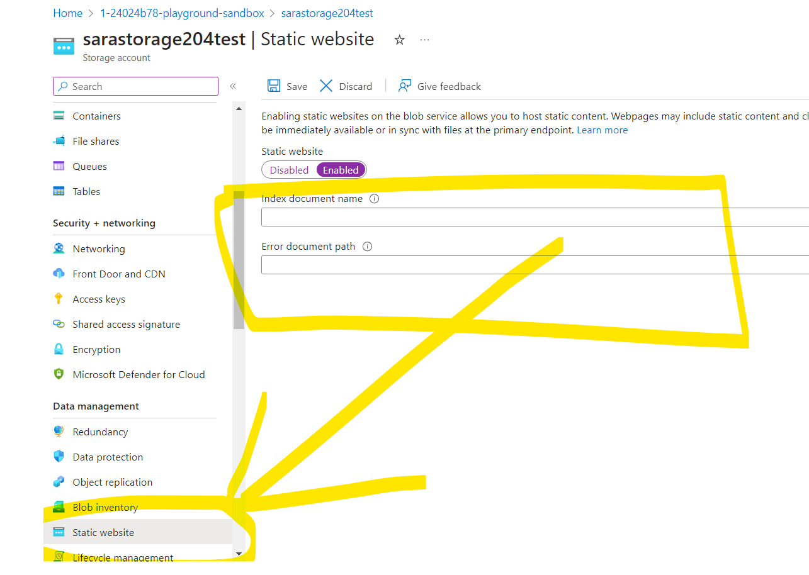

#### Static Webistes

You can serve static content directly from a storage container named **$web**
- Hosting your content in Azure Storage enables you to use serverless architectures 
- It doesn't require a web server to render content.
- CORS support is not supported with static website.
- **we can configure custom domain**
- No way to configure headers as part of the static website feature. However, you can use Azure CDN to add headers and append (or overwrite) header values
-  For HTTPS access, Azure Content Delivery Network (CDN) must be used.

>***Note: The container name is automatically created as $web***

>***Static WEbsites are Free BUT we have to pay for storage account :-)***

