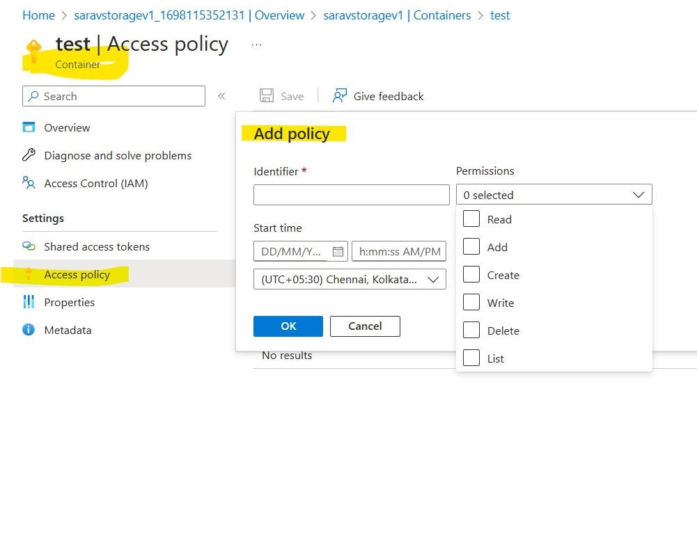

#### Stored Access Policy

A Stored Access Policy in Azure provides an additional level of control over service-level Shared Access Signatures (SASs)

- You can use a Stored Access Policy to change the start time, expiry time, or permissions for a signature.
- You can also use it to revoke a signature after it has been issued

##### Storage resources supports Stored Access Policies:
- Blob containers (Blob containers... not individual blobs)
- File shares
- Queues
- Tables

