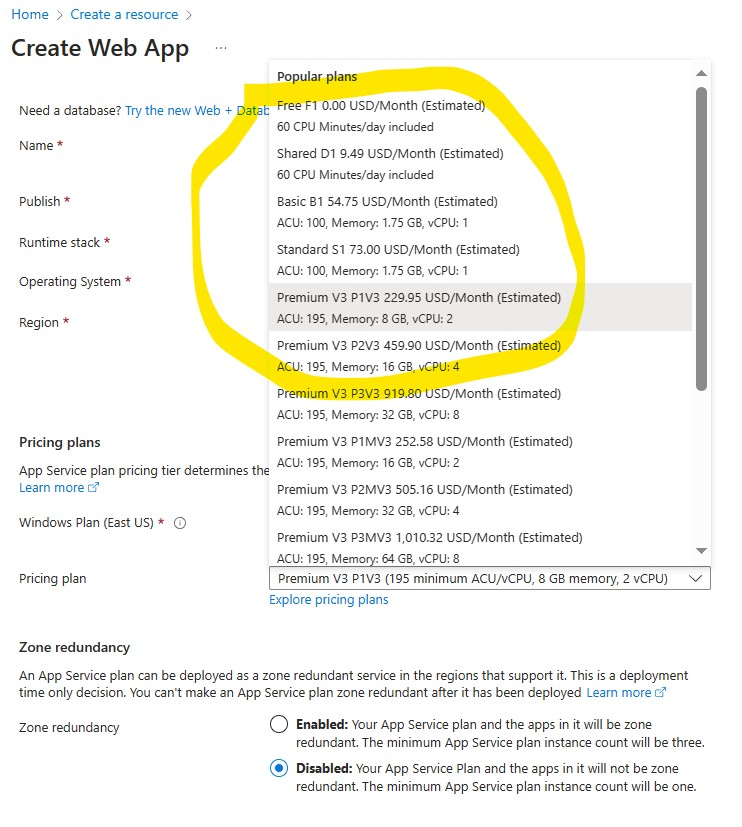

 >Note : *Azure Functions, Azure App Service WebJobs with the WebJobs SDK is a code-first integration service that is designed for developers. **Both are built on Azure App Service***

- we no need to maintain any container or server
- Supports devops tooling with bitbucket, github etc.,
- we cannot run Linux on shared tiers (first two  -  Free , Dev/Test)

Diagnostics
----------------
1. storage account is required to store the logs
