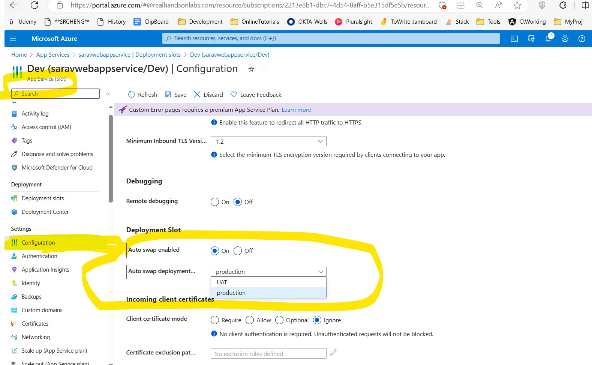

#### Azure App service Deployment slots


#### How Slot swapping works?
**Consider**
- Source slot - Staging Slot
- Target Slot - Production Slot

**Steps**
1. Apply below settings from Target to Source if applicable
    - Auth settings, CICD settings, App settings and Connection strings
2. This will trigger all instances in the source slot to restart and operation will paused our validation
3. Wait for every instance in Source to get restarted and if restart fails in sap operation will be stopped and changes will be reverted on source slot
4. If auto swap is enabled with custom warm-up, trigger Application Initiation by making an HTTP request to the application root ("/") on each instance of the source slot
5. If all instances on the source slot are warmed up successfully, swap the two slots by switching the routing rules for the two slots.

> ***At any point of the swap operation, all work of initializing the swapped apps happens on the source slot. The target slot remains online while the source slot is being prepared and warmed up, regardless of where the swap succeeds or fails.***

---
> ***To configure an app setting or connection string to stick to a specific slot (not swapped), go to the Configuration page for that slot. Add or edit a setting, and then select Deployment slot setting. Selecting this check box tells App Service that the setting isn't swappable***


---

#### Configure Auto Swap
- helps to deploy continuously with **zero cold starts and zero downtime*** for customers
- Auto swap isn't currently supported in web apps on Linux and Web App for Containers.

#### Steps to configure auto swap
1. Select a slot on which u want to configure auto swap
2. Then Select
   Configurations -> General Settings



---

#### Custom warm-up
The applicationInitialization configuration element in web.config lets you specify custom initialization actions. The swap operation waits for this custom warm-up to finish before swapping with the target slot
```XML
<system.webServer>
    <applicationInitialization>
        <add initializationPage="/" hostName="[app hostname]" />
        <add initializationPage="/Home/About" hostName="[app hostname]" />
    </applicationInitialization>
</system.webServer>

```

 #### App settings
- **WEBSITE_SWAP_WARMUP_PING_PATH**: Path to ping to warm up your site. Add this app setting by specifying a custom path that begins with a slash as the value. Default value is /.
- **WEBSITE_SWAP_WARMUP_PING_STATUSES**: Valid HTTP response codes for the warm-up operation. Add this app setting with a comma-separated list of HTTP codes. If the returned status code isn't in the list, the warmup and swap operations are stopped. By default, all response codes are valid.
- **WEBSITE_WARMUP_PATH**: Relative path on the site that should be pinged whenever the site restarts (not only during slot swaps). Example values include /statuscheck or the root path, /.


#### Route traffic in App Service
- By default, all client requests to the app's production URL
- We can set  Traffic %  percentage to specific slot and it will randomly route the users to Staging or Prod slots
- User automatically routed to a specific slot, it's "pinned" and pinned stlot mentioned the cookie *x-ms-routing-name=staging | x-ms-routing-name=slef*
- x-ms-routing-name=self means prod slot
- We can make end user to opt for specific slot by make them to use specific query string. This overrides the Trafic % Configruation
```html
<a href="<webappname>.azurewebsites.net/?x-ms-routing-name=self">Go back to production app</a>
```
