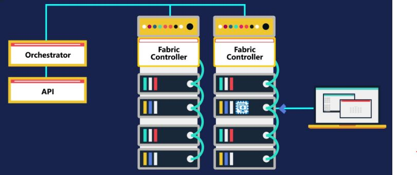

Each physical servers connected to Fabric Controller. And all the fabric controllers connected to Orchestrator.
We can interact Orchestrator with its API.
For example if we are trying to create new VM through Azure portal then internally it will connect to Orchestrator via its api and  Orchestrator will create VM wiht help of fabric controller on any physical server

### Orchestrator->Fabric Controller->Physical server

---

> ***In Azure most computer hardwares can be emulated as software using Hyperviser***
