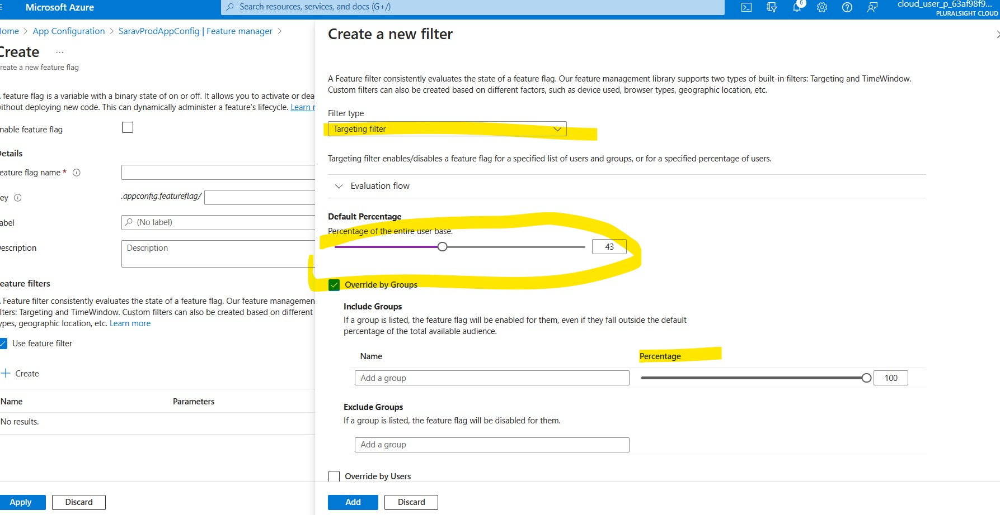
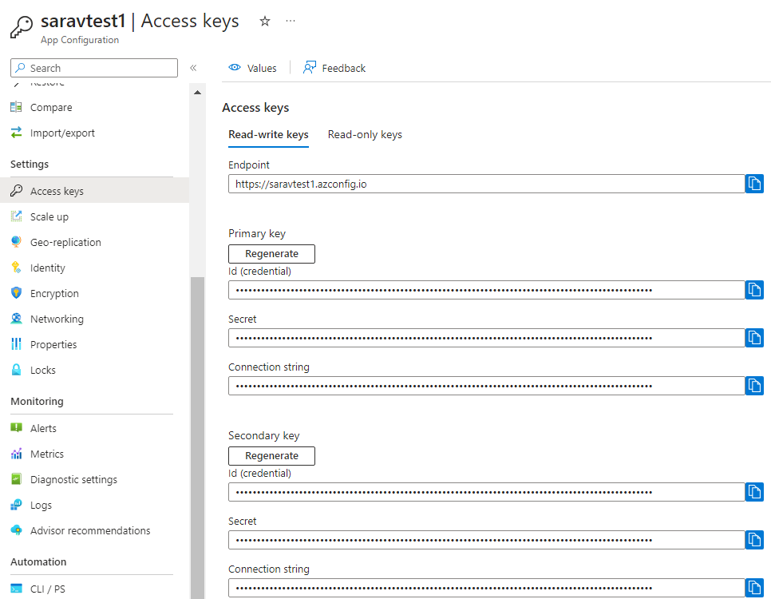

#### Azure App Configuration
> *This is not same as Azure App Service's App Configuration*

#### Access
- It is not scoped at the resource group or subscription level, but rather it is an Azure resource that you create and manage like other Azure resources
- We can use RBAC to control the access.
- In RBAC, we can specify a scope at four levels: management group, subscription, resource group, and resource

---

#### Lables
- A key app1 with labels A and B forms two separate  keys in an App Configuration store
- This is extra property which is optional
- Each key value is **uniquely identified by its Key + Label**
- Label can be null
- If we are using same key name then we can use Lables to differenetiate.
- labels are a way to organize/ group  and manage your configuration data
- Ex: ProdConfig, RegionConfig
- App Configuration doesn't version key values automatically as they're modified. Use labels as a way to create multiple versions of a key value.
- Ex: you can input an application version number or a Git commit ID in labels to identify key values associated with a particular build
---

#### Feature flags -  on/off a feature
- It is a variable that can be used to control the behavior of an application without having to re-deploy it.
- This can be used to enable or disable new features, experiment with different features,
- Target features to
    - Specific users
    - Specific user Groups
    - Specific Time Period
    - Custom - Ex: Specific region, Browser etc.,
- If there is multiple filters, the filter list is traversed in order until one of the filters determines the feature should be enabled. At that point, the feature flag is on, and remaining filter results skipped

---

#### Security - Access Keys
This is simlar to SAS (Shared Access Signature ). which help us to access the connection strings through applicaitons
.

Also we can use Azure AD  to secure. And we know that we can use RBAC to assign the roles to any azure principals

#### Feature flag repository
- To use feature flags effectively, you need to externalize all the feature flags used in an application. This approach allows you to change feature flag states without modifying and redeploying the application itself

- Azure App Configuration is designed to be a centralized repository for feature flags.

### [Ref: Secure App Configuration](https://learn.microsoft.com/en-us/training/modules/implement-azure-app-configuration/5-secure-app-configuration-data)
