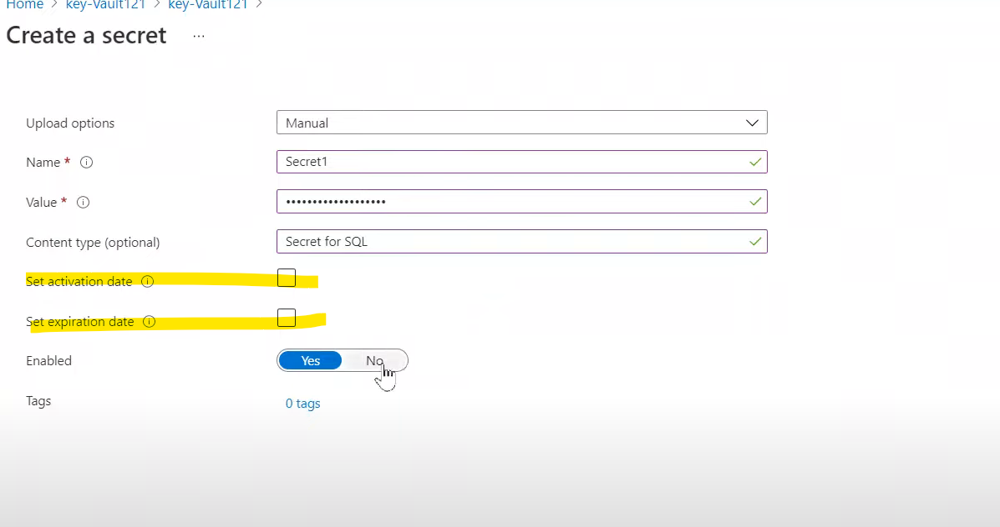

> Note : *Azure Kevault is not the place to store the user passwords*

We can store secure artifacts
- SAS tokens
- Tokens
- Keys
- Manage the Certificates -  Automate the management (like Certificate expiry scenarios)

#### Tier
- Standard
- Premium - Hardware module also part of this if needed we can use it

#### UI Form

---

---
### Azure Key Vault Overview
- Helps manage secrets, keys, and certificates.
- It supports two types of containers: vaults and managed hardware security module (HSM) pools.
- Vaults can store software and HSM-backed keys, secrets, and certificates, while managed HSM pools only support HSM-backed keys.

#### Key Features
1. **Secrets Management**: Securely store and control access to tokens, passwords, certificates, API keys, and other secrets.
2. **Key Management**: Create and control the encryption keys used to encrypt your data.
3. **Certificate Management**: Easily provision, manage, and deploy public and private SSL/TLS certificates.

#### Azure Key Vault has two service tier
- Standard (software key encryption)
- Premium (includes HSM-protected keys)

#### Benefits of Azure Key Vault
- **Centralized application secrets**
- **Secure storage for secrets and keys**: Access requires proper authentication and authorization. Authentication is done via Microsoft Entra ID.
- **Monitor access and use**:
   - Enable logging for your vaults to monitor activity.
- **Simplified administration of application secrets**:
    - Automating certain tasks on certificates that you purchase from Public CAs, such as enrollment and renewal
    - Azure Key Vault simplifies the process of securing information, following a life cycle, ensuring high availability, scaling up on short notice to meet usage spikes, and automating certain tasks on certificates.

---
#### Authentication
You need to authenticate to Key Vault before you can use it. There are three methods:

1. **Managed identities for Azure resources**: This is the recommended method. Azure resources like virtual machines can be given an identity that has access to Key Vault. Azure handles the rotation of the service principal client secret linked with the identity.

2. **Service principal and certificate**: This method involves using a service principal and a related certificate that can access Key Vault. It's not recommended because the certificate must be rotated by the application owner or developer.

3. **Service principal and secret**: This method uses a service principal and a secret for authentication. It's not recommended because rotating the bootstrap secret used for authentication is difficult.

---

**Data Encryption**
Azure Key Vault uses the Transport Layer Security (TLS) protocol to protect data during transit between Azure Key Vault and clients. Perfect Forward Secrecy (PFS) and RSA-based 2,048-bit encryption key lengths are used to secure connections, making it hard for data in transit to be intercepted.

**Best Practices**
- Use separate key vaults for each application and environment.
- Only allow authorized applications and users to access your vault.
- Regularly backup your vault.
- Enable logging and alerts.
- Enable soft-delete and purge protection to prevent force deletion of secrets.
