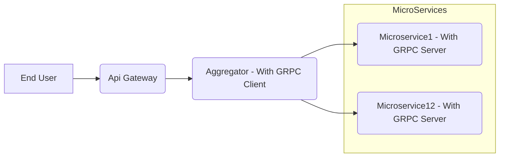

# Microservices - gRPC Communication
###### gRPC is a high-performance, open source, universal RPC framework from Google
>
gRPC is a modern open source high performance Remote Procedure Call (RPC) framework that can run in any environment

> *Note: An alternate for GRPC can be REST*
> *REST is Text based and it not having standard API contract. So every client have to write their client libraries*
> *GRPC is binary protocol*

GRPC is implemented on top of HTTP/2 and Protocol buffer.
> *HTTP/2 is mandatory*


GRPC is highly recomended for Internal Microservices Communication. Because it is more efficient, low latency.

When we build multiple microservices with different technologies and programming languages, it is important to have a standard way to define service interfaces and underlying message interchange formats.


* Can push the data
* Real time communicaiton
* Different programming languages can communicate
  * > *Note: Official support avaliable for  .Net Core, Net 4.5+*


[Refer official documentation for GRPC](https://grpc.io/docs/what-is-grpc/introduction/)

###### Example implementation of GRPC in MicroServices


##### Protobuf Format
Protocol Buffers is a free and open-source cross-platform data format used to serialize structured data.
gRPC uses Protobuf Language for Communication. Protobuf is a mechanism for serializing structured data in a standard way. When compare to other formats (JSON, XML) Protobuf is smaller, faster

[Refer official documentation for Protobuf syntax](https://developers.google.com/protocol-buffers/docs/proto3)


###### Kestrel Configuration

``` json
'Kestrel': {
    'EndpointDefaults': {
      'Protocols': 'Http2'
    }
"
```


[//]: # (Tags: gRPC, Protobuf, Microservices, Remote Procedure Call Framework, MicroServices Communication)
[//]: # (Type: Microservices - GRPC)
[//]: # (Rating: 2)
[//]: # (Languages:powershell)
[//]: # (ReadyState:Publish)
