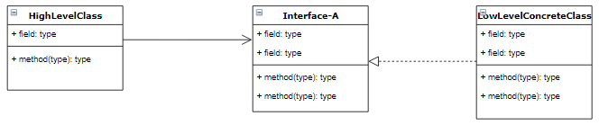

#### Dependency Inverison Principle
###### Understanding Dependency Inverison Principle
>
High-level modules (Classe/ Components) should not depend on low-level modules. Both should depend on abstractions (Mostly interfaces).

In Below example HighLevelClass class depends on Interface-A. LowLevelConcreteClass also dependes on Interface-A. There is no direct link between high level class and low level class

[//]: # (Tags: Dependency Inverison Principle)
[//]: # (Type: SOLID - Dependency Inverison Principle)
[//]: # (Rating: 2)
[//]: # (Languages:powershell)
[//]: # (ReadyState:Publish)
