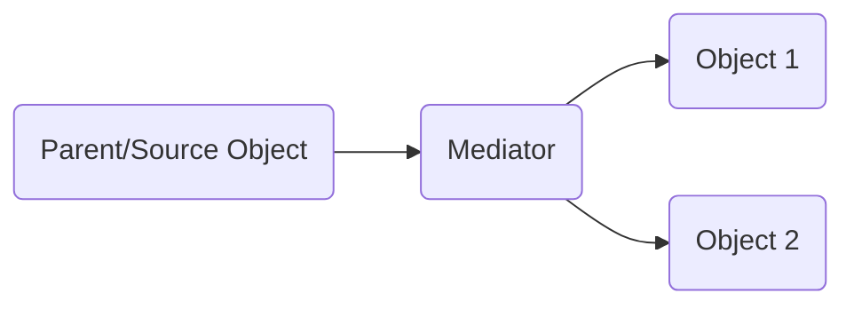

#### How to use MediatR Nuget Package in .Net Core application
###### Simple Steps to use MediatR Nuget package

    `


##### About Mediatr Nuget Package
MediatR nuget package help us implement Mediator and CQRS design patterns in .Net Core application.

---

#### About Mediator Design pattern
Mediator design pattern helps us to avoid the direct communcation between the objects



---


##### About CQRS Pattern
CQRS - Command and Query Responsibility Segregation.This pattern helps to separate read and update operations for a data store

---

#### Steps to use MediatR Nuget package
###### 1. Install  Required Nuget Packages
```powershell
PM> MediatR.Extensions.Microsoft.DependencyInjection
```


###### 2. Create Command Class
```csharp
// Note: IRequest provided by MediatR
public class CreateStudentCommand : IRequest<int>
{
   public int RecordId { get; set; }
   public string StudentName { get; set; }
}
```

###### 3. Create Handler by inheriting IRequestHandler<CreateStudentCommand, int> interface
IRequestHandler force us to implement Handle method where we have to implement the logic to be executed
```csharp
// Note: IRequestHandler<in TRequest, TResponse> provided by MediatR

public class CreateStudentHandler : IRequestHandler<CreateStudentCommand, int>
{
  public async Task<int> Handle(CreateStudentCommand request, CancellationToken cancellationToken)
  {
    // Perform Studen creatioon Operation
  }
}
// If we dont want to return anything from the handler then we have to use Unit as return type
public class CreateStudentHandler : IRequestHandler<CreateStudentCommand, Unit>
{
  public async Task<Unit> Handle(CreateStudentCommand request, CancellationToken cancellationToken)
  {
    // Perform Studen creatioon Operation
    return Unit.Value;
  }
}

```
###### 4. Register MediatR Services in Startup.cs
```csharp
public void ConfigureServices(IServiceCollection services)
{
  // .. Other Service configuraitons

  // Note: AddMediatR Extension method provided by MediatR
  services.AddMediatR(Assembly.GetExecutingAssembly());
}
```

###### 5. Use the Mediator in controller with help of dependency injection and start using it
> *Note: In below example im using AutoMapper to transform the object*
```csharp
private readonly IMediator _mediator;
private readonly IMapper _Mapper;
public StudentController(IMediator mediator)
{
   _mediator = mediator;
   _Mapper = mapper;
}

public async Task<IActionResult> Post(StudentDetailsVm objStudentDetailsVm)
{
    var objCreateStudentCommand = _Mapper.Map<CreateStudentCommand>(objStudentDetailsVm);
    var result = await _mediator.Send(objCreateStudentCommand);
    if (result != 0)
        return Ok(objStudentDetailsVm);
    return BadRequest();
}
```


[//]: # (Tags: MediatR, CQRS,  .Net Core, Mediator pattern,)
[//]: # (Type: .Net Core - Nuget Packages)
[//]: # (Rating: 2)
[//]: # (Languages:powershell,csharp)
[//]: # (ReadyState:Publish)
