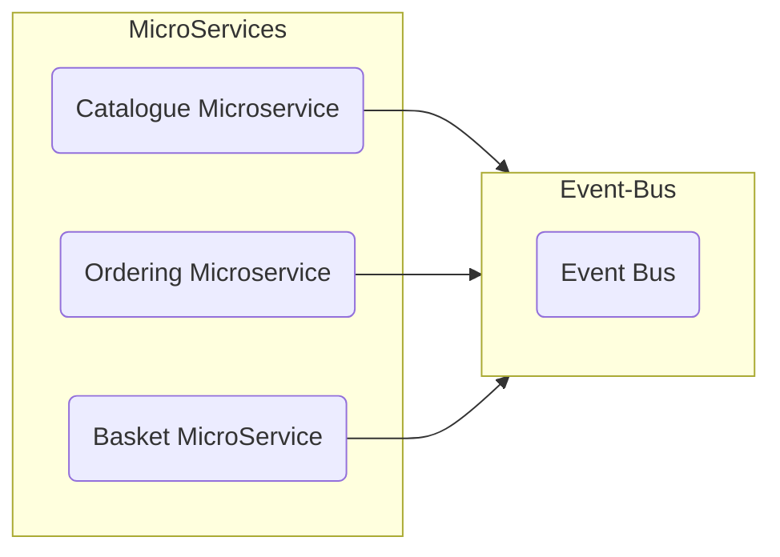

```c
Basket Microservice

  + Basket Cart
      calculatePrice()
      -UserName
      -TotalPrice
      + BasketCartItem
          - Qty, Price, PRoductId, PRodName, Colour

BasketCheckout
  - username, country, state, zipcode,
  - carno, cvv, expiration etc.,
```
