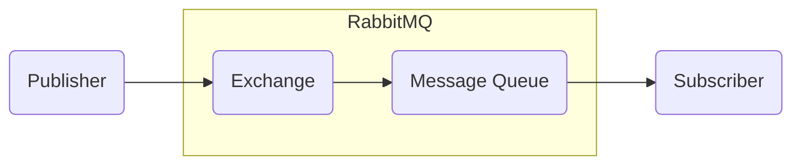

#### RabbitMQ
###### RabbitMQ fundamentals
>

It is a Open source message broker.
Basically it is a message queue system (We know Queue system will use FIFO algorithm (i.e first in first out)).
It uses Advanced Message Queuing Protocol (AMQP)

```
Other few message queue systems similar to RabbitMQ
- Appachi Kafka
- Azure Service Bus
- MSMQ
```


Queue    -  This stores the messages and pass it to Subscriber using FIFO algorithm
Exchange -  Based on routing cases it decides to which Queue it needs to send/broadcast the messages


###### To Run RabbitMQ in Docker
1. Download official RabbitMQ Image from Docker hub and run using below Command
```csharp
docker run -d --hostname first-rabbit --name test-rabbit -p 15672:15672 -p 5672:5672 rabbitmq:3-management
// Port - 15672 for RabbitMQ administration dashboard
// Port - 5672 Actually used by RabbitMQ
```
2. Now RabbitMQ should be running in your local system
3. Browse the URL - http://localhost:15672/ to access RabbitMQ's admin dashboard
   - default credentials - guest/guest

---
#### Connect Asp.Net Core with RabbitMQ
###### Basic Steps to use RabbitMQ
1. Install RabbitMQ.Client using nuget package manager
```powershell
PM> Install-Package RabbitMQ.Client
// By default it will use standard ports. so we no need to provide any connection details
```

1. Create Connection *IConnectionFactory.Connect()*
2. Create Model *IModel.CreateModel()*-- Which creates new channel and New Queue on RabbitMQ
3. Now Queue is ready to use


// Which creates new channel and New Queue on RabbitMQ;
// To create a new queue you have create a model

[//]: # (Tags: Connect Asp.net core with RabbitMQ)
[//]: # (Type: Docker - Commands)
[//]: # (Rating: 2)
[//]: # (Languages:powershell)
[//]: # (ReadyState:Publish)
