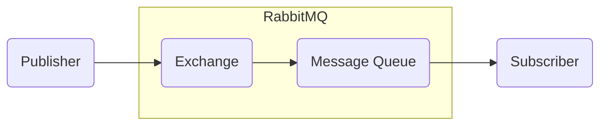

#### RabbitMQ
###### RabbitMQ - Lightweight, Open source message broker.
>

Basically it is a message queue system and it uses FIFO algorithm (i.e first in first out).
It is Lightweight, Open source message broker and It can be deployed in distributed and federated configurations to meet high-scale.
We know Queue system will use FIFO algorithm (i.e first in first out)).
> In microservices RabbitMQ can  uased as Service BUS.

###### Protocols used in RabbitMQ
RabbitMQ supports multiple messaging Protocols directly or through pluggins
* AMQP - Advanced Message Queuing Protocol
* STOMP - Text based Lightweight Protocol
* MQTT - Lightweight binary Protocol

RabbitMQ supports **HTTP and WebSockets**  - through some pluggins. But those are really not messaging Protocol

Other few message queue systems similar to RabbitMQ
- Appachi Kafka
- Azure Service Bus
- MSMQ

---

###### Diagram to understand about RabbitMQ

Queue    -  This stores the messages and pass it to Subscriber using FIFO algorithm
Exchange -  Based on routing cases it decides to which Queue it needs to send/broadcast the messages
> Publishers will not directly send the messages to Queue. It will send the messages to Exchange and the exchanges will send the messages to Queue based on routing configuration

---

###### RabbitMQ Components

###### Core Properties/Configurations  of RabbitMQ
1. Queue name
2. Life Time of the Queue (It can be in memory)

###### RabbitMQ - Exchange
Exchange decides the routing algorithm between Publisher and Queue. Multiple types of Exchanges are available based on routing algorithm
1. **Direct**
    Message routes to the queues whose binding key exactly matches the routing key of the message.
    The routing key is a message attribute added to the message header by the producer.
2. **Fanout**
    In this type of exchange the same messages will be routed to multiple Queues. It is used for ***Broadcasting*** the messages
3. **Topic**
    Message routes to one or more Queus based on the Matching between the routing key **with routing pattern** and message.
    Few valid routing key examples: "stock.usd.nyse", "nyse.vmw", "quick.orange.rabbit".
4. **Header**
   Messages get routed based on the header attributes. Routing key attributes not used here

[//]: # (Tags: Connect Asp.net core with RabbitMQ, What is RabbitMQ, Run RabbitMQ with docker)
[//]: # (Type: RabbitMQ - Asp.net)
[//]: # (Rating: 2)
[//]: # (Languages:powershell)
[//]: # (ReadyState:Inprogress)
