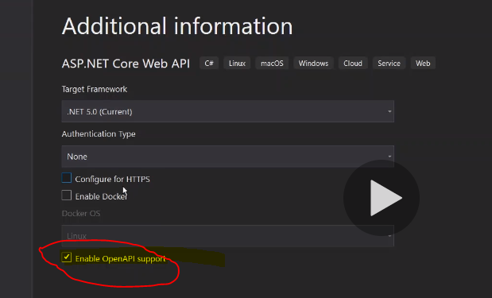

#####On-Demand Large-Object heap compaction
When you use 32-bit systems, the processes running under them may throw the OutOfMemory exception in case your app is making use of large amount of memory, like large arrays. The On-demand large object heap compaction is now supported in .NET framework 4.5.1 to avoid the OutOfMemory exception. This feature is available as an on-demand feature as it is expensive. The Garbage Collection pause time is more and hence using this feature needs to be decided based on the situation.
You can set this feature using GCSettings which comes under System.Runtime namespace. The GCSetting provides a property LargeObjectHeapCompactionMode that has two values - Default and CompactOnce. The default value is Default which does not compact the Large Object Heap compaction during Garbage collection. If you assign the property a value of CompactOnce, the Large Object Heap is compacted during the next full blocking garbage collection, and the property value is reset to GCLargeObjectHeapCompactionMode.Default
# My understanding - Normally GC will not compact large object heap, it will only do clean, Becuase
compacting (copy and move) will take time for larger objects. so infuture it will use those
free spaces (holes), to store the other new objects. But this is causing outofmemory exception, When
there is not continus memory not available for other big objects.To avoid that
On-Demand Large-objject heap compaction introduced. It is a configuration. If we enable this
then GC will do Sweeping and Commpacting both. But it will have performance hit.
If our application uses more Huge volume of objects then we can enable this feature.

- When we select .Net 5 framework there will be a check box called **Enable openapi support**. If we select this then automatically Swagger getting added

Edit and Continue feature -  while debugging time we can able to modify the code on the fly

$ReturnValue - Inspecting Method return value while debugging using Autos
 	Window as well as a pseudo variable
